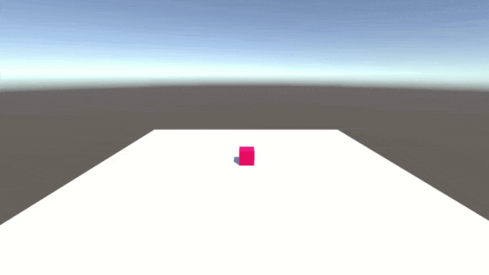
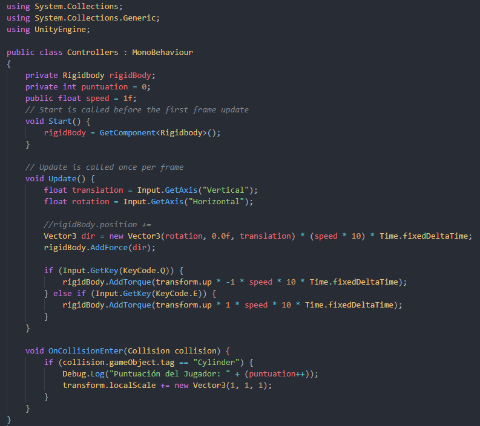

# P2 - Introducción a los Scrips en Unity
* **Asignatura:** Interfaces Inteligentes
* **Autor:** Marta Julia González Padrón
* **Correo:** alu0101254487@ull.edu.es

## Enunciado Práctica

### 1. Crear una escena simple sobre la que probar diferentes configuraciones de objetos físicos en Unity. La escena debe tener un plano a modo de suelo, una esfera y un cubo.

#### a) Ninguno de los objetos será físico.
Como los objetos no tienen física, se quedan suspendidos en el aire.

#### b) La esfera tiene físicas, el cubo no.
Igual que la práctica anterior, añadir físicas a un objecto es tan sencillo como añadir *Rigidbody* como componente. Al tener gravedad la esfera cae pero el cubo no.

#### c) La esfera y el cubo tienen físicas.
Se aplica lo mismo que en el paso anterior pero para el cubo. Ambos tienen gravedad

#### d) La esfera y el cubo son físicos y la esfera tiene 10 veces la masa del cubo.
Como vemos en el siguiente gif, cuando dos objetos con la misma masa se chocan, ninguno se rueda.

La masa de un objeto se modifica en el bloque del componente. 

Aumentarla causa que al chocarse, la esfera sea capaz de empujar al cubo

#### e) La esfera tiene físicas y el cubo es de tipo IsTrigger.

En el panel derecho, en el componente *Box Collider* se puede activar la opción *Is Trigger*.

Lo que causa que el objeto sea traspasable.

#### f) La esfera tiene físicas, el cubo es de tipo IsTrigger y tiene físicas.

Ahora como el cubo también tiene física y por lo tanto gravedad, traspasa el terreno y cae al infinito

#### g) La esfera y el cubo son físicos y la esfera tiene 10 veces la masa del cubo, se impide la rotación del cubo sobre el plano XZ.

Een el apartado del componente *Ridigbody* del cubo y hay una opción *Freeze Rotation* y se escogen los ejes que no se quieren rotar.

Cuando no esta activado y dejamos caer la esfera sobre el cubo, se ve claramente que el cubo vibra.

Sin embargo si bloqueamos la rotacion se queda quieto

### 2. Sobre la escena que has trabajado ubica un cubo que represente un personaje que vas a mover. Se debe implementar un script que haga de CharacterController. Cuando el jugador pulse las teclas de flecha (o aswd) el jugador se moverá en la dirección que estos ejes indican.

#### a) Crear un script para el personaje que lo desplace por la pantalla, sin aplicar simulación física.

#### b) Agregar un campo público que permita graduar la velocidad del movimiento desde el inspector de objetos.

#### c) Estar a la escucha de si el usuario ha utilizado los ejes virtuales. Elegir cuáles se va a permitir utilizar: flechas, awsd.
Coge ambos controles por defecto.

#### d) Elegir otros ejes virtuales para el giro y girar al jugador sobre el eje OY (up).
Lo he implementado con la tecla Q para girar a la izquierda y con la tecla E para girar a la derecha.

### 3. Sobre la escena que has trabajado programa los scripts necesarios para las siguientes acciones:

* #### Se deben incluir varios cilindros sobre la escena. Cada vez que el objeto jugador colisione con alguno de ellos, debe aumentar su tamaño y el jugador aumentar puntuación.

Adicionalmente, si se bloquean los ejes de rotación, el cubo se mueve de otro modo

* #### Agregar cilindros de tipo A, en los que además, si eel jugador pulsa la barra espaciadora lo mueve hacia afuera de el.

* #### Se deben incluir cilindros que se alejen del juugador cuando esté próximo.

* #### Ubicar un tercer objeto que sea capaz de detectar colisiones y que se mueva con las teclas: I, L, J, K

- #### Debes ubicar cubos que que aumentan de tamaño cuando se le acerca el jugador y que disminuye cuando se le acerca el tercer objeto.

